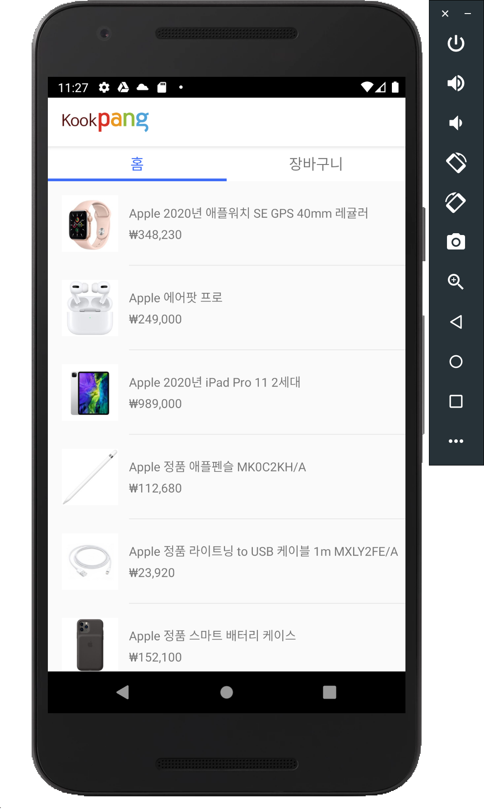
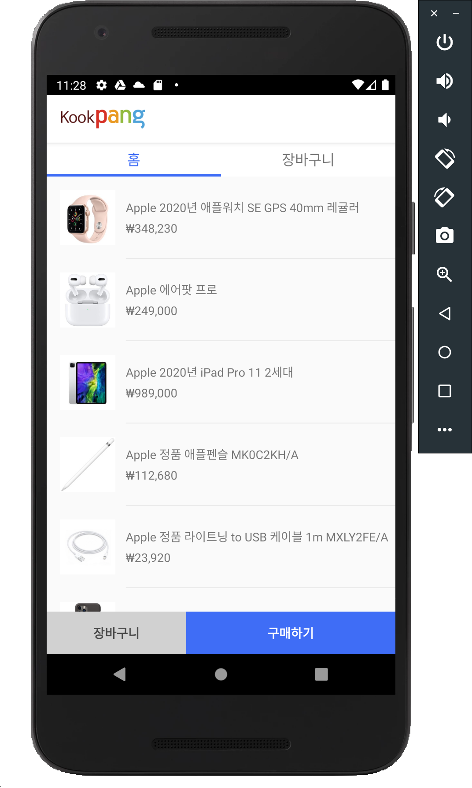
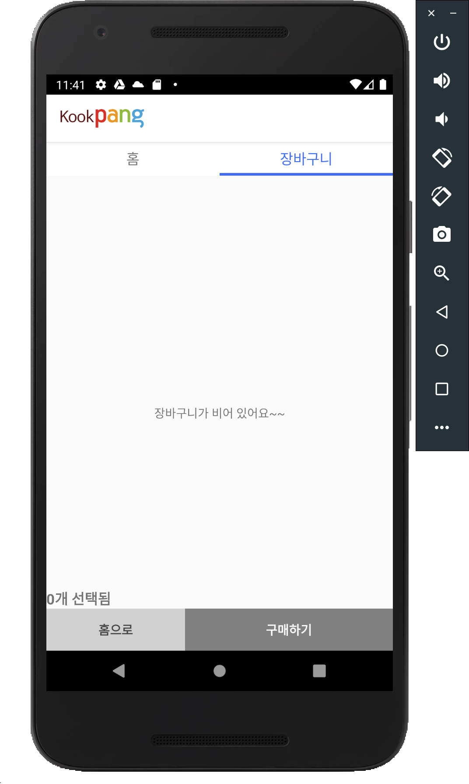
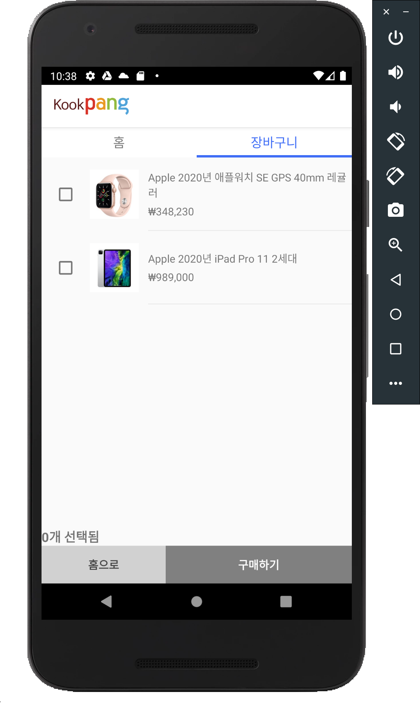
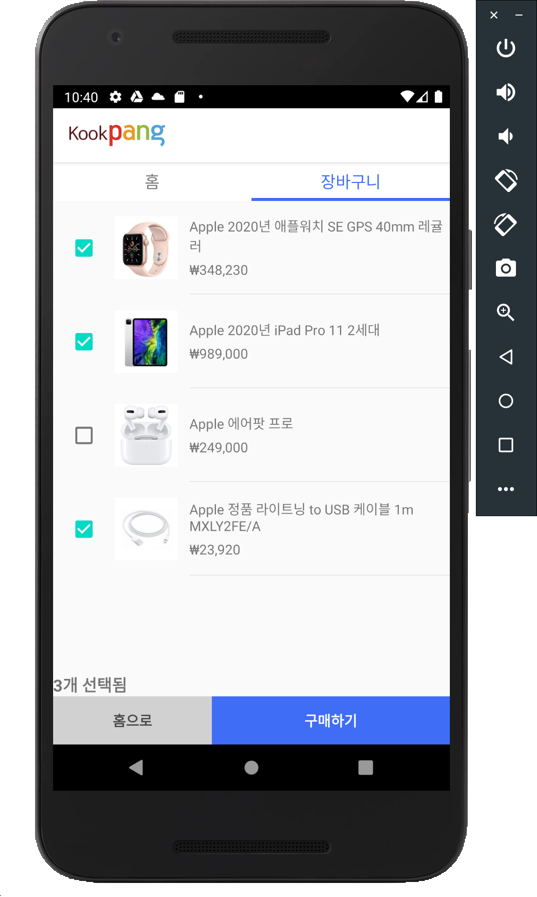
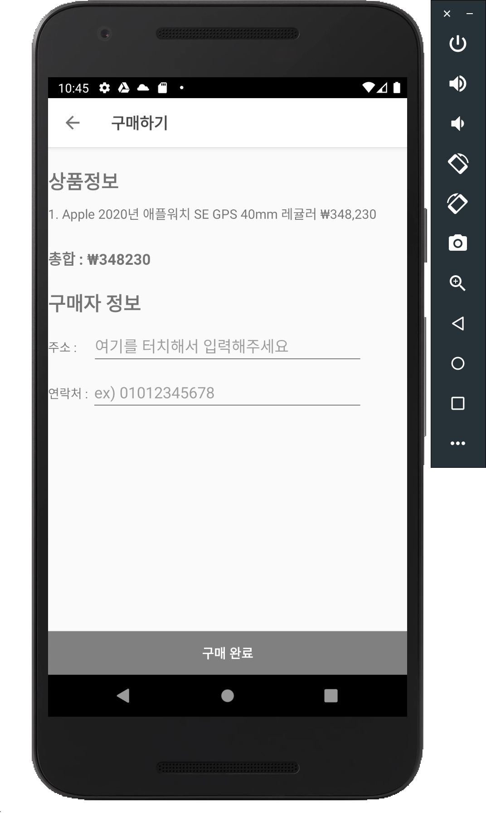
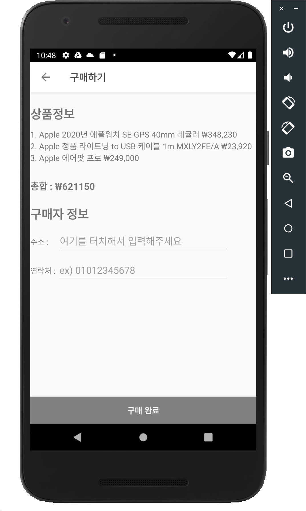
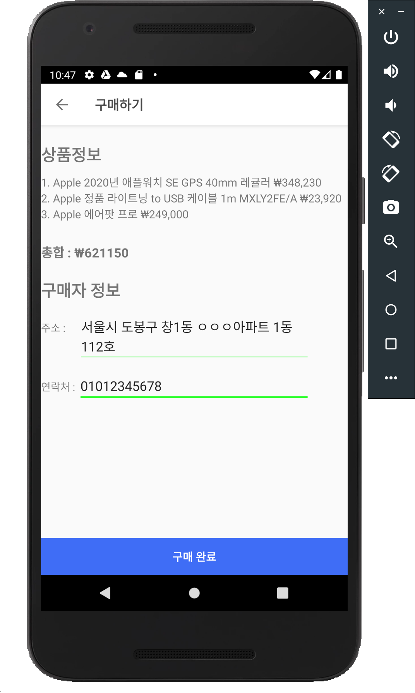
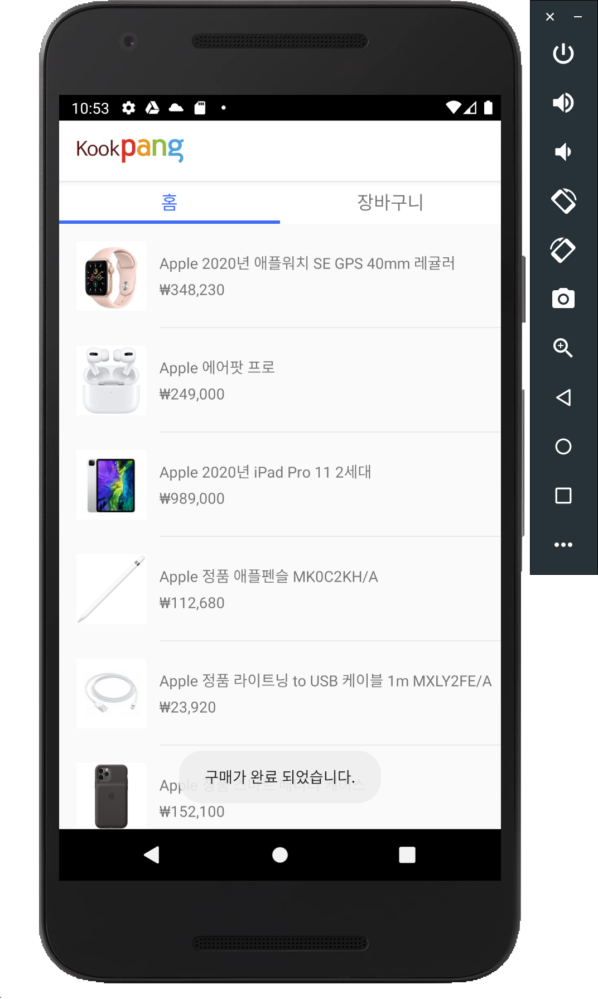

<h4 align="center">
  </a>
</h4>
<h4 align="center">국민대 X Coupang</h4>
<h5 align="center">학교 과제를 위해 제작된 앱임을 알립니다</h5>

## 과제 개요
1. 평가 : 첫번째 화면 5점, 두번째 화면 5점, 세번째 화면 5점
          (만점 15점, 각 화면의 구성+동작으로 평가)

2. 총점  : 15점
   * 가산점: Firebase 연동
   * 감점  : 동작중 비정상적인 앱 종료 

첫번째 화면 (Relative Layout 혹은 Fragment 사용)
- 상품 선택 페이지
- 상품은 2개이상 화면에 출력. 각 상품의 제품명, 가격 정보 표시 
- 상품 선택하면 아래에 버튼으로 구매 혹은 장바구니 선택
- 장바구니 버튼을 클릭시에는 두번째 화면으로 이동
- 구매 버튼을 클릭시에는 세번째 화면으로 이동

두번째 화면 (Linear Layout 혹은 Fragment 사용)
- 장바구니 페이지
- 장바구니에 추가한 상품명, 가격 정보 출력
- 구매 버튼과 홈버튼을 출럭
- 홈버튼을 클릭하면 첫번째 페이지로 이동
- 상품별로 선택(Radio 버튼, 체크 박스 활용) 여부 체크후에
  구매 버튼을 클릭하면 세번째 페이지로 이동

세번째 화면 (Table Layout, Grid Layout 중 하나 사용)
- 구매 페이지
- 선택한 제품명, 가격 정보를 출력
- 선택한 제품이 여러개면 결재할 총합 선택
- 주소정보, 연락처 입력
- 구매 완료시에 첫번째 화면으로 이동

* 각페이지 구성시에 View을 상속한 여러가지 위젯을 사용하여 화면을 구성
  (기능에 맞는 위젯 선택하여 구성)
   ListView, GridView, AdapterView, ToolBar, Text View, CheckBox, Switch, 
   ToggleButton, RadioButton, ImageView, ImageButton 등

과제 제출
- 과제 결과는 구현내용(Readme 파일), 소스 파일은 압축(ZIP)하여 등록

감사합니다.

## 사용 기술
- Android Studio 
- Kotlin
- Realm Database (https://realm.io/docs/kotlin/latest/)
- Firebase Realtime Database (https://firebase.google.com/products/realtime-database?hl=ko)
- lastAdapter (https://github.com/nitrico/LastAdapter)
- Glide (https://github.com/bumptech/glide)

## 구현 내용

### 첫번째 화면(상품 선택 페이지)
1. 아무 상품도 선택하지 않았을때
  

1. 상품을 선택했을때(화면 아래에 버튼이 나타남, 각 버튼 클릭시 해당 화면으로 이동)
  

### 두번째 화면(장바구니 페이지)

1. 장바구니에 아무것도 담겨 있지 않을때
  

1. 장바구니에 아이템이 추가되었을때 (선택하지 않으면 '구매하기' 버튼은 비활성화, '홈으로' 버튼 정상적으로 작동)
  

1. 여러 품목들을 동시에 선택하였을때 (구매하기 버튼 활성화)
  

### 세번째 화면(구매 페이지)

1. <b>단일</b> 품목을 선택한후 '구매하기' 진행했을때
  

1. <b>여러</b> 품목을 선택한후 '구매하기' 진행했을때
  

1. 주소, 연락처 정보를 채우면 버튼 활성화
  

1. 구매 완료 하면 홈으로 이동후 Toast 안내
  

## 추가 구현 내용

1. 실시간 품목 정보 변경 가능 
<b>Firebase Realtime Database</b> 활용 하여 앱에 상품정보 실시간 반영됨  

1. 장바구니 품목 유지 
<b>Realm local DB</b>를 활용해 앱을 종료해도 장바구니 아이템이 사라지지 않고 계속 유지됨  

